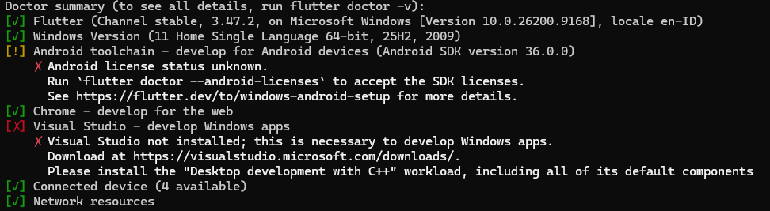
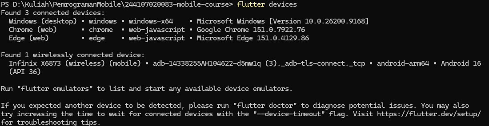
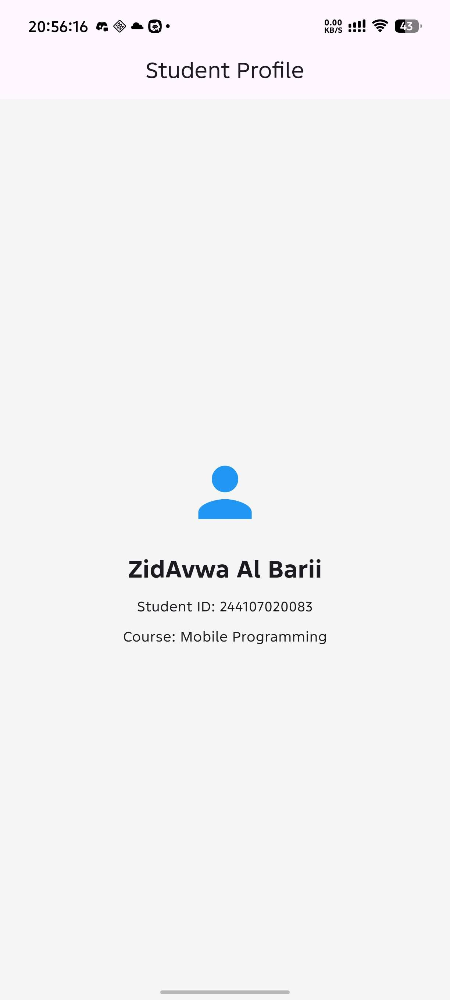

# Flutter Week 1 - Mobile Development Ecosystem

This project is a simple Flutter application created for the Week 1 mobile development exercise.

## Checklist

- Flutter doctor has no issue blocking the Android target.
- Flutter devices detects an emulator or physical device.
- The application runs and its default UI has been replaced with a simple profile.
- You can explain the difference between hot reload and hot restart.
- The remote repository contains source code, README, screenshots, and commit history.

## Project Description

This app displays a simple student profile page with:

- a profile icon
- student name
- course information
- a clean mobile-friendly layout

## Screenshots

### Flutter Doctor

### Flutter Devices

### Simple Profile Result

## Hot Reload vs Hot Restart

- Hot reload: updates the code in the running app quickly without restarting the app.
- Hot restart: restarts the app and rebuilds the app state from the beginning.

## Reflection

- When is native development more appropriate than cross-platform development?

When the app needs high performance, deep device features, or platform-specific UI/UX.
- How does a state change relate to the widget tree and declarative UI?

When state changes, Flutter rebuilds only the affected widgets in the widget tree, based on the new state.
- Why are small commits with clear messages useful for teamwork and a portfolio?

They make collaboration easier, help track progress clearly, and show professional development history in a portfolio.

This project is a basic Flutter starter app that has been customized to match the assignment requirements for a simple profile screen.
