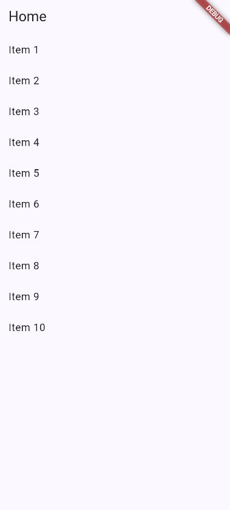
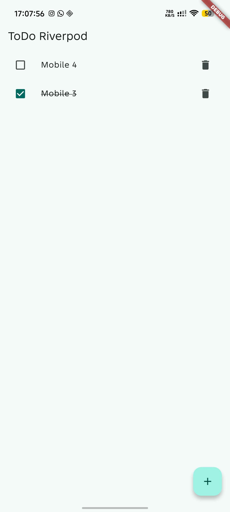
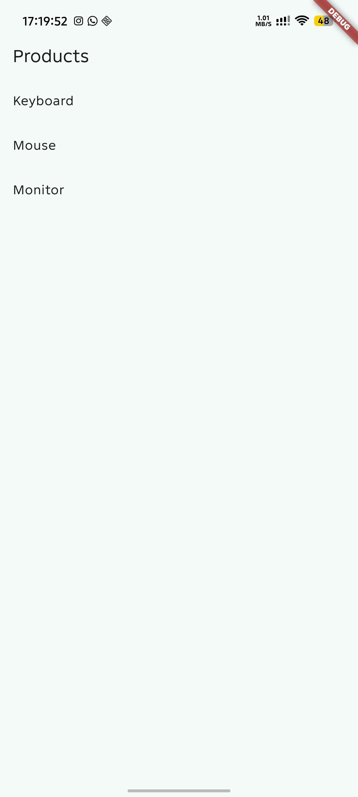
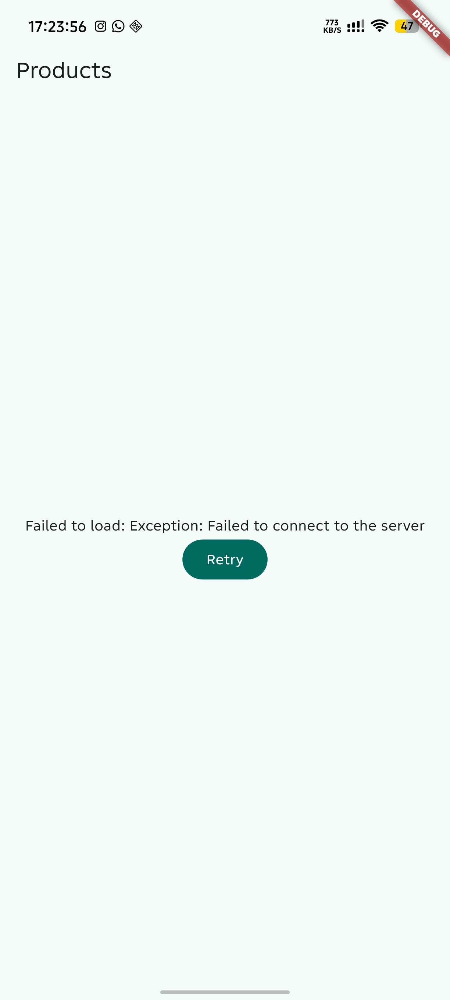
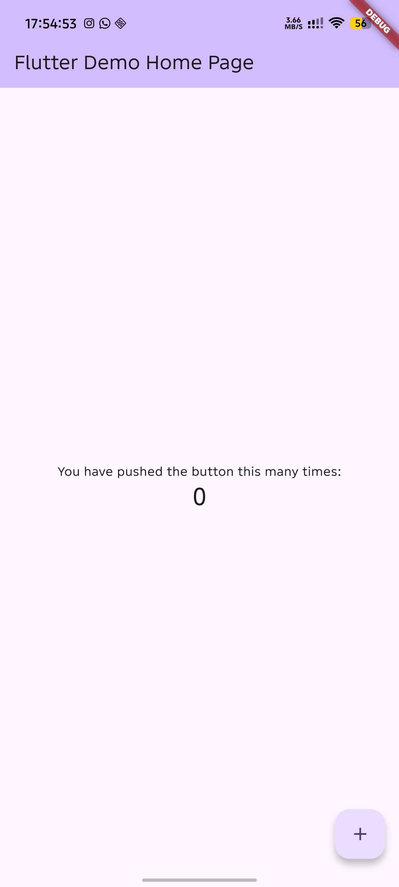

# Flutter Week 3 - Navigation and State Management

This project repository contains multiple Flutter applications created for the Week 3 mobile development assignment, focusing on multi-page navigation with GoRouter and state management with Riverpod.

## Verification Checklist

*(Pending)*

## Project Stages

### 1. Lab 1 — Multi-page application with GoRouter
The `week3_navigation` project was created to implement declarative routing using the `go_router` package.
- Organized the folder structure to separate `main.dart`, `home_page.dart`, and `detail_page.dart`.
- Defined the router configuration in `lib/main.dart` with an initial location and nested routes for dynamically accessed items.
- Built a `ListView.builder` where tapping an item triggers `context.go('/detail/${index + 1}')` to navigate to the specific detail page.

### 2. Lab 2 — ToDo application with Riverpod
The `week3_todo` project introduces state management by wrapping the application in a `ProviderScope`.
- Created a `Todo` state class and a `TodoListNotifier` provider to manage the list of tasks.
- Converted the main page into a `ConsumerWidget` to listen to state changes.
- Implemented the UI using `ref.watch(todoListProvider)` inside the `build` method to automatically rebuild the page when the list changes.
- Used `ref.read(todoListProvider.notifier)` inside the checkbox callback to call methods without subscribing.

### 3. Lab 3 — Test all three states (AsyncValue)
Addressed the problem of managing asynchronous state by using Riverpod's `AsyncValue` to handle loading, error, and success states without relying on error-prone boolean flags.
- Tested the loading screen by observing the initial delay.
- Temporarily altered the `build()` method to throw an exception (`throw Exception('Failed to connect to the server')`) to observe the error screen and its Retry button.
- Verified that pressing Retry invalidates the provider and restores the success state.

### AI Verification Checklist

* **Is state mutated immutably (no `state.add()` or direct list mutation)?**
Yes. The `StatsNotifier` returns a newly constructed array of strings upon success, avoiding direct list mutations.

* **Is `ref.watch` used only inside `build`, and `ref.read` inside callbacks?**
Yes. `ref.watch(statsProvider)` is exclusively used inside the `build` method to rebuild the UI on state changes. Inside the `FilledButton` callback, `ref.invalidate(statsProvider)` is correctly used to trigger a retry without subscribing to the provider.

* **Are all three AsyncValue states really handled (not only success)?**
Yes. The `statsAsync.when()` method explicitly handles the `loading` state with a `CircularProgressIndicator`, the `error` state with an error message and a retry button, and the `data` state with a `ListView.builder`.

* **Is the provider declared with an explicit type and not duplicated with other providers?**
Yes. The provider is explicitly typed as `AsyncNotifierProvider<StatsNotifier, List<String>>` and is declared globally without duplication.

* **Does the AI code use old Riverpod APIs (`StateProvider` antipattern, deprecated `StateNotifierProvider`, or unnecessary nested `Consumer`)? Fix them to use the `Notifier` / `ConsumerWidget` pattern.**
No deprecated APIs are used. The generated code utilizes the modern `AsyncNotifier` class for the provider and extends `ConsumerWidget` directly for the page layout rather than nesting a `Consumer`.

* **Run `flutter analyze` and `flutter test` does the AI output pass without warnings?**
The provided unit test correctly structures the test environment using a `ProviderContainer` to override the `statsProvider` with a deterministic test class (`TestStatsNotifierSuccess`) to verify the expected data.

## Reflection

*(Pending)*

