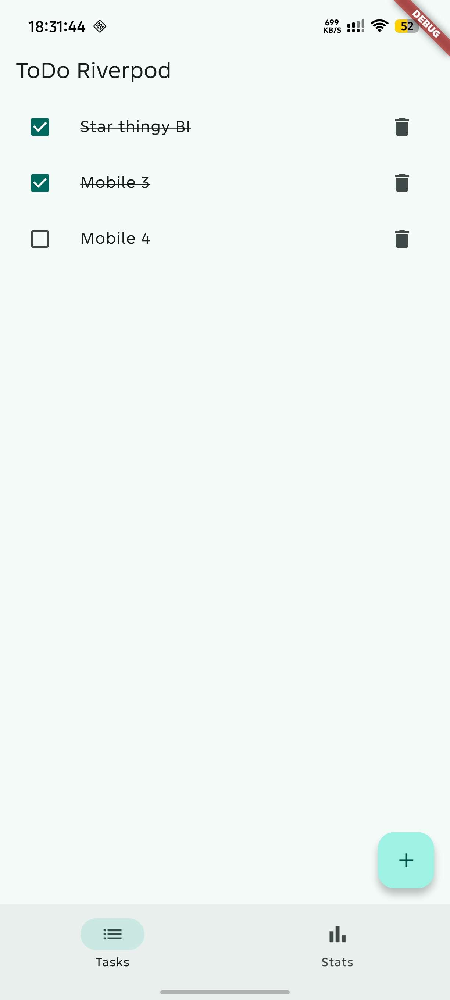
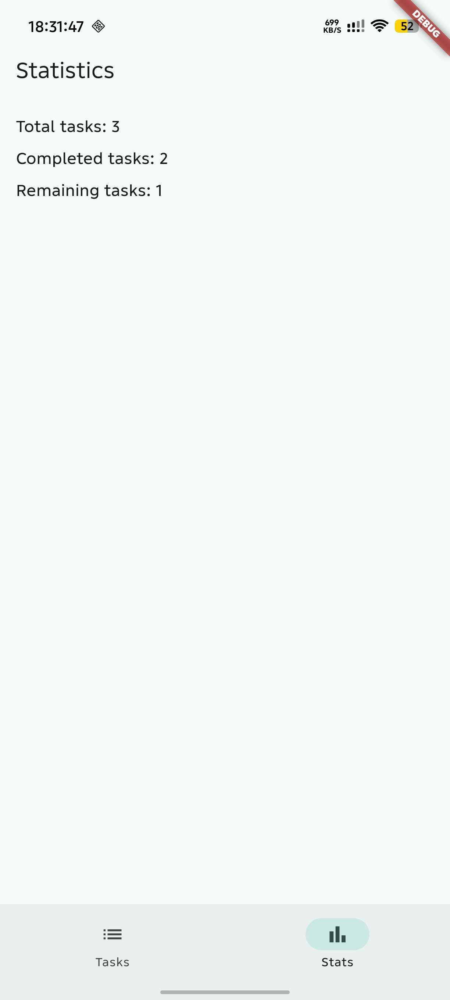
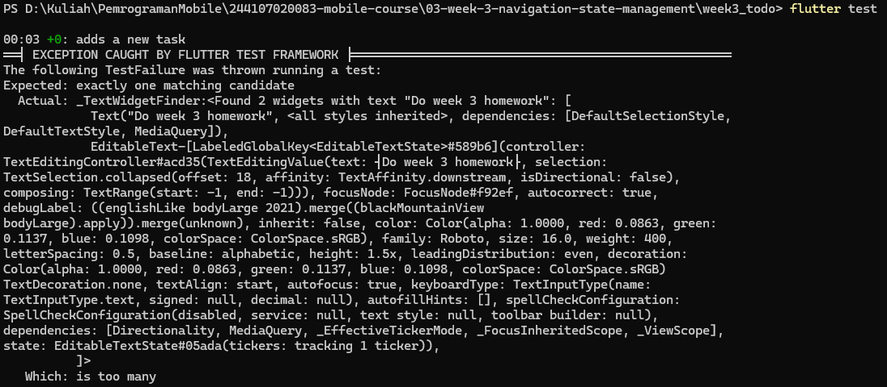
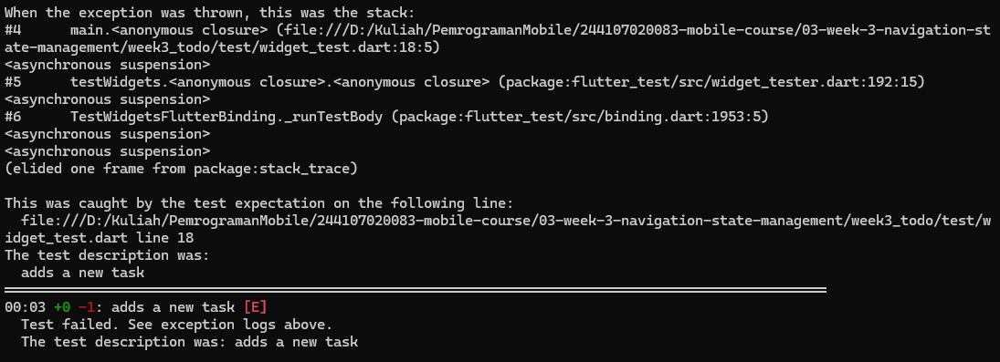

# Flutter Week 3 - Navigation and State Management

This project repository contains multiple Flutter applications created for the Week 3 mobile development assignment, focusing on multi-page navigation with GoRouter and state management with Riverpod.

## Verification Checklist

*(Pending)*

## Project Stages

### 1. Lab 1 — Multi-page application with GoRouter
The `week3_navigation` project was created to implement declarative routing using the `go_router` package.
- Organized the folder structure to separate `main.dart`, `home_page.dart`, and `detail_page.dart`.
- Defined the router configuration in `lib/main.dart` with an initial location and nested routes for dynamically accessed items.
- Built a `ListView.builder` where tapping an item triggers `context.go('/detail/${index + 1}')` to navigate to the specific detail page.

### 2. Lab 2 — ToDo application with Riverpod
The `week3_todo` project introduces state management by wrapping the application in a `ProviderScope`.
- Created a `Todo` state class and a `TodoListNotifier` provider to manage the list of tasks.
- Converted the main page into a `ConsumerWidget` to listen to state changes.
- Implemented the UI using `ref.watch(todoListProvider)` inside the `build` method to automatically rebuild the page when the list changes.
- Used `ref.read(todoListProvider.notifier)` inside the checkbox callback to call methods without subscribing.

### 3. Lab 3 — Test all three states (AsyncValue)
Addressed the problem of managing asynchronous state by using Riverpod's `AsyncValue` to handle loading, error, and success states without relying on error-prone boolean flags.
- Tested the loading screen by observing the initial delay.
- Temporarily altered the `build()` method to throw an exception (`throw Exception('Failed to connect to the server')`) to observe the error screen and its Retry button.
- Verified that pressing Retry invalidates the provider and restores the success state.

## AI Verification Checklist

* **Is state mutated immutably (no `state.add()` or direct list mutation)?**
Yes. The `StatsNotifier` returns a newly constructed array of strings upon success, avoiding direct list mutations.

* **Is `ref.watch` used only inside `build`, and `ref.read` inside callbacks?**
Yes. `ref.watch(statsProvider)` is exclusively used inside the `build` method to rebuild the UI on state changes. Inside the `FilledButton` callback, `ref.invalidate(statsProvider)` is correctly used to trigger a retry without subscribing to the provider.

* **Are all three AsyncValue states really handled (not only success)?**
Yes. The `statsAsync.when()` method explicitly handles the `loading` state with a `CircularProgressIndicator`, the `error` state with an error message and a retry button, and the `data` state with a `ListView.builder`.

* **Is the provider declared with an explicit type and not duplicated with other providers?**
Yes. The provider is explicitly typed as `AsyncNotifierProvider<StatsNotifier, List<String>>` and is declared globally without duplication.

* **Does the AI code use old Riverpod APIs (`StateProvider` antipattern, deprecated `StateNotifierProvider`, or unnecessary nested `Consumer`)? Fix them to use the `Notifier` / `ConsumerWidget` pattern.**
No deprecated APIs are used. The generated code utilizes the modern `AsyncNotifier` class for the provider and extends `ConsumerWidget` directly for the page layout rather than nesting a `Consumer`.

* **Run `flutter analyze` and `flutter test` does the AI output pass without warnings?**
The provided unit test correctly structures the test environment using a `ProviderContainer` to override the `statsProvider` with a deterministic test class (`TestStatsNotifierSuccess`) to verify the expected data.

### Modifications to AI-Generated Code

After reviewing the AI's output, the following corrections and adjustments were made to ensure the application runs correctly and matches the project standards:

- **Added ProviderScope:** The AI generated a standard Flutter `main.dart` template without Riverpod integration. I wrapped the root `MyApp` widget in a `ProviderScope` so the providers could be read by the application.
- **Updated Home Route:** Changed the `home` property in `main.dart` to point to the newly generated `StatsPage` instead of the default `MyHomePage` counter widget.
- **Code Formatting and Cleanup:** Stripped out all the excessive explanatory comments generated by the AI to maintain a clean codebase and adhere to my standard coding style.

## Refactoring and Testing 

### 1. Refactoring & Code Structure

* **Extracted `TodoTile**`: Isolated the task list item row into `lib/widgets/todo_tile.dart` to make `TodoPage` cleaner and simpler to test.

* **Derived Riverpod Providers**: Created `unfinishedTodosProvider` and `todoStatsProvider` in `lib/providers/todo_provider.dart` to compute filtered tasks and aggregate statistics reactively from `todoListProvider`.

* **GoRouter & ShellRoute Integration**: Replaced standard navigation with `GoRouter` utilizing `ShellRoute` and a persistent `NavigationBar` to switch between `/` (Task List) and `/stats` (Statistics).

### 2. Asynchronous State Handling

* **`AsyncNotifier` Implementation**: Built `ProductsNotifier` extending `AsyncNotifier` to handle asynchronous data fetching.

* **Three-State UI Pattern**: Used `AsyncValue.when` inside `ProductPage` to explicitly cover `loading` (progress indicator), `error` (error display with retry button), and `data` (content list).

* **Error Recovery**: Tested manual exception handling and verified that triggering `ref.invalidate` re-runs the provider build cycle.

### 3. Testing

I always don't understands how these tests works.

## Reflection

* **When is `setState` still enough, and when should state be lifted into Riverpod?**
  Use `setState` for local, ephemeral UI state (e.g., toggling a password visibility icon or handling animation states). Lift state to Riverpod when data needs to be shared across multiple screens or separated from UI logic.

* **What is the difference between `context.go` and `context.push`, and when should each be used?**
  `context.go` updates the route path directly without appending to the stack, making it ideal for tab-based bottom navigation. `context.push` pushes a new page onto the navigation stack, preserving back-button history for detail screens.

* **How does `AsyncValue` prevent bugs compared with three separate booleans?**
  Separate booleans (`isLoading`, `hasError`, `hasData`) can cause invalid state combinations (e.g., both loading and error being true). `AsyncValue` enforces mutually exclusive states (`loading`, `error`, `data`) and forces you to handle all cases safely via `.when()`.

* **Which part of the AI output did you fix, and why?**
  Wrapped `MyApp` in `ProviderScope` to fix runtime provider lookup errors, changed `state.uri.pathname` to `state.uri.path` to fix Dart syntax errors, and removed auto-generated comments to keep the code clean.

