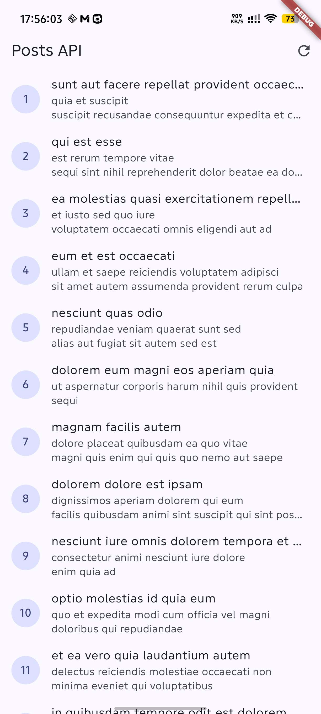
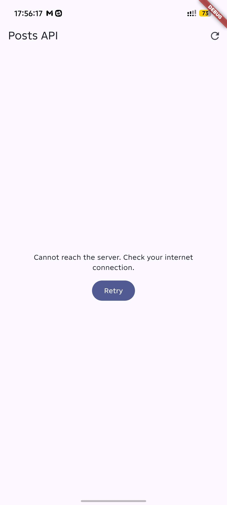
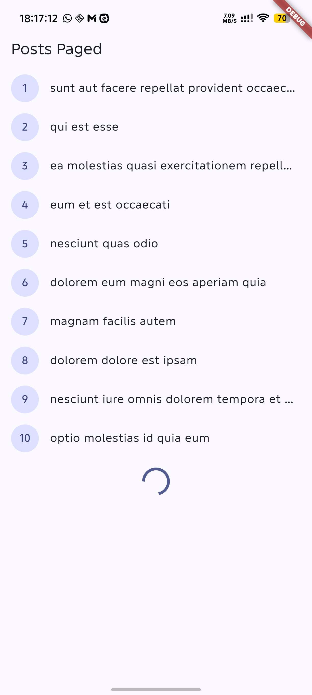
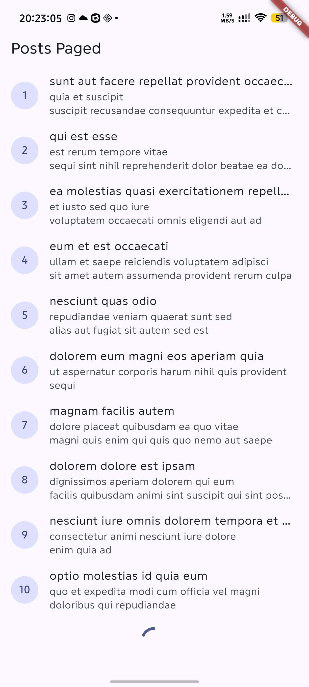

# Flutter Week 4 - Networking and REST API

This project demonstrates REST API access with Dio, Riverpod state management,
pagination, error handling, and detail navigation with GoRouter.

## Project Stages

### 1. Lab 1 - Dio and data models

setup

### 2. Lab 2 - Provider and error handling

Mapped Dio exceptions into messages that users can understand.
- Covered timeout, connection, bad response, and fallback error types.
- Added a retry action when the server cannot be reached.
- Kept Dio calls inside repositories instead of calling Dio from widgets.

### 3. Lab 3 - Basic pagination

Added paginated loading and a detail screen for individual posts.
- Loaded posts in groups of ten as the user reaches the bottom of the list.
- Added the `/post/:id` GoRouter route.
- Reused a cached post when available, or fetched it from the repository when
  the detail page is opened directly.

## AI Verification Checklist

* **Does the UI call Dio directly (forbidden) or go through the repository?**
Yes. Widgets read Riverpod providers, providers create repositories, and the
repositories perform the Dio requests.

* **Is `fromJson` null-safe, or does it still use direct casts that can crash?**
`Post.fromJson` handles missing fields and non-string title/body values safely.
`Comment.fromJson` still uses direct nullable string casts and should be made
defensive before the code is considered complete.

* **Are all `DioExceptionType` values mapped to user messages?**
Yes. Timeout, connection, bad response, and fallback Dio errors are mapped in
the shared network error helper and the comment error helper.

* **Are `baseUrl` and timeouts centralized in one client?**
Mostly. The shared Dio client owns the base URL and default timeouts, although
the comment repository still repeats timeout options on its request.

* **Does the test cover an edge case?**
Yes. `post_test.dart` verifies missing `title` and `body` fields, provider
success and error states, and connection-error messaging. `widget_test.dart`
also verifies the extracted post row.

* **Do `flutter analyze` and `flutter test` pass?**
Yes. `flutter analyze` reports no issues and `flutter test` passes all 5 tests.

## Refactoring and Testing

* **Extracted `PostTile`** into `lib/widgets/post_tile.dart` so both list pages
  share the same row layout and the `ListView.builder` code stays short.
* **Moved `friendlyErrorMessage`** into `lib/data/network_errors.dart` so the
  regular list, paginated list, and detail page use the same mapping.
* **Tested the refactoring** with model, provider, error-message, and widget
  tests.

## Reflection

* **Why is the UI forbidden from calling Dio directly? What breaks if this rule
  is violated?**
  Keeping Dio inside the repository separates networking from presentation,
  makes widgets easier to test, and keeps API configuration in one place. If a
  widget calls Dio directly, HTTP details become duplicated in the UI and
  changing or mocking the API becomes more difficult.

* **When is client-side pagination enough, and when must you rely on server
  pagination (`_page` / `_limit`)?**
  Client-side pagination is enough for a small dataset that has already been
  downloaded and can safely be filtered or sliced locally. Server pagination is
  better for large or frequently changing datasets because the app downloads
  only the requested page. This project uses `_page` and `_limit` in
  `fetchPostsPage` and loads the next page when the user reaches the bottom.

* **How do repository exceptions become `AsyncError` without try/catch in every
  widget? When is explicit try/catch still needed?**
  An exception thrown by a repository future returned from an `AsyncNotifier`
  `build()` method is captured by Riverpod and exposed as `AsyncError`. Explicit
  try/catch is still needed in imperative notifier methods such as refresh and
  pagination when the notifier must preserve existing items, update custom
  loading flags, or store the error in its own state.

* **Which part of the AI output did you fix, and why?**
  I made `Post.fromJson` tolerate missing and non-string fields, replaced the
  generated counter test with API and widget tests, extracted `PostTile`, moved
  `friendlyErrorMessage` into a shared network error file, and added the
  `/post/:id` detail flow. These changes keep networking out of the UI, make
  error states testable, and avoid duplicated list-row and error-message code.
