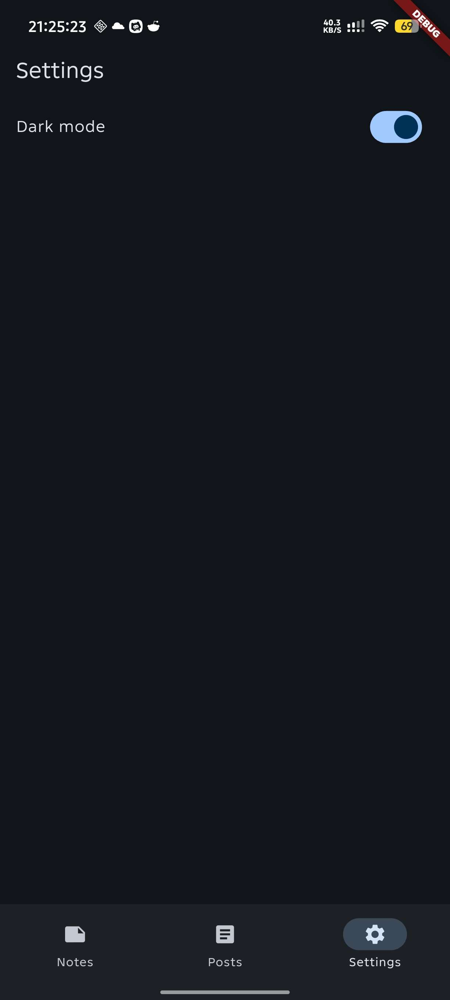
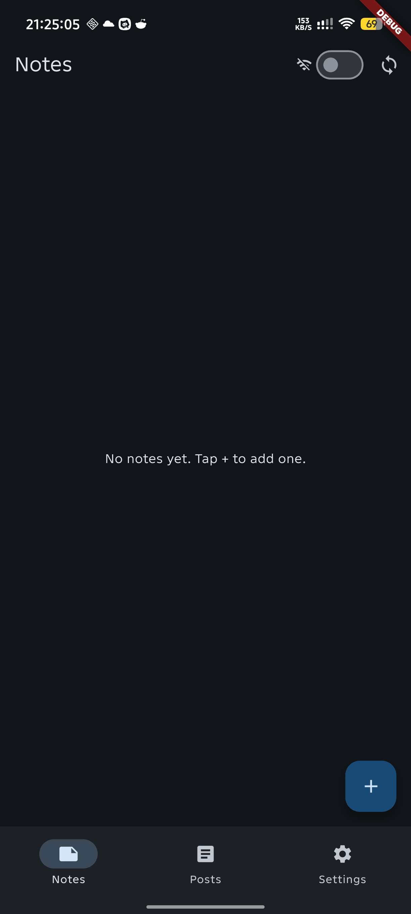
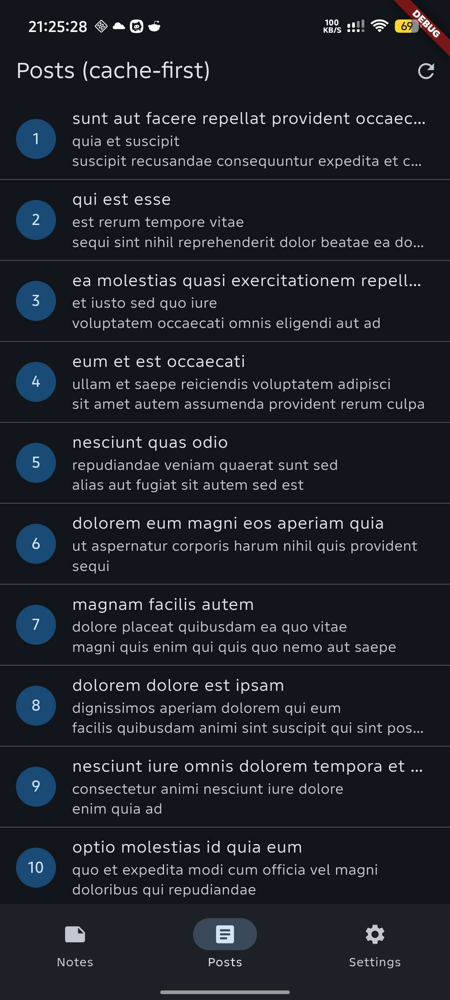
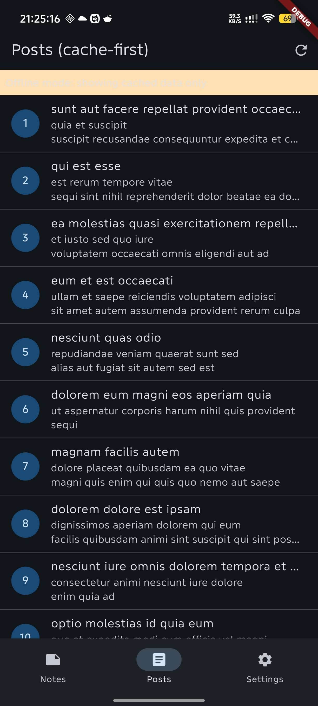

# Flutter Week 5 - Local Storage & Offline First

## Project Stages

### 1. Lab 1: SharedPreferences

Set up the project and save the dark mode preference locally.
- Store UI theme settings with `SharedPreferences`.
- Load the saved theme on startup through an `AsyncNotifier`.
- Keep the settings screen separate from the notes experience.

### 2. Lab 2: SQLite and the notes repository

Build the local notes database and move all database work behind a repository.
- Create a SQLite database for notes.
- Add repository methods for reading, inserting, deleting, and counting dirty
  notes.
- Keep a `dirty` flag so unsynced notes can be identified later.
- Display a sync badge when the app has data waiting to be uploaded.

### 3. Lab 3: Cache-first and the sync queue

Add the offline-first cache flow and sync behavior for local notes and posts.
- Read cached posts immediately when the app opens.
- Refresh data in the background when the app is online.
- Keep showing cached content while the app is offline.
- Simulate note sync by marking dirty notes as synced after the upload step.

# AI MESSED EVERYTHING UP IDK ANYMORE. PLS STOP WITH THESE AI CHALLENGE AI CHALLENGE #