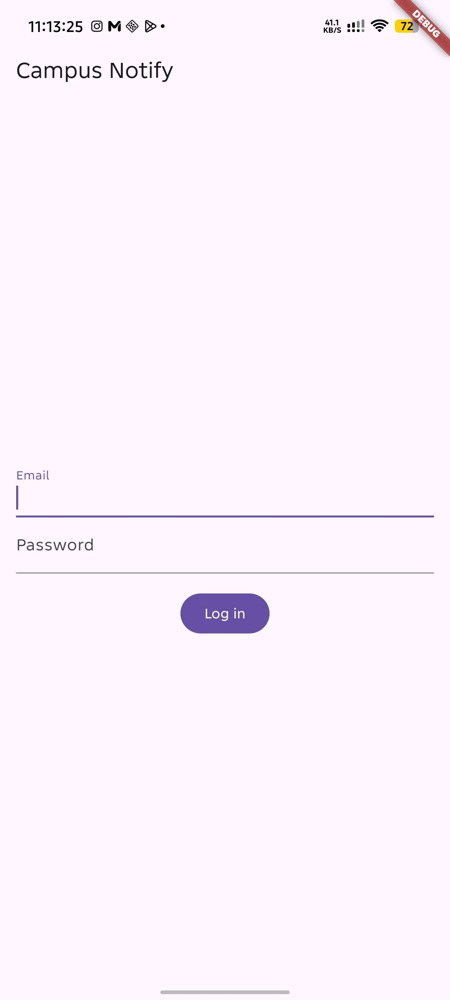
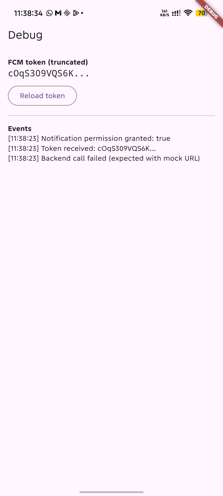
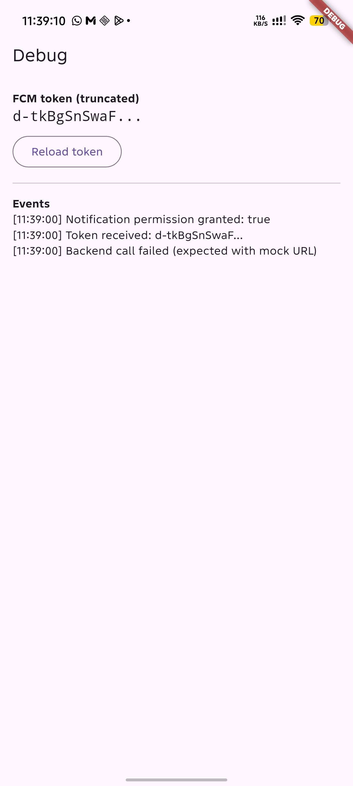
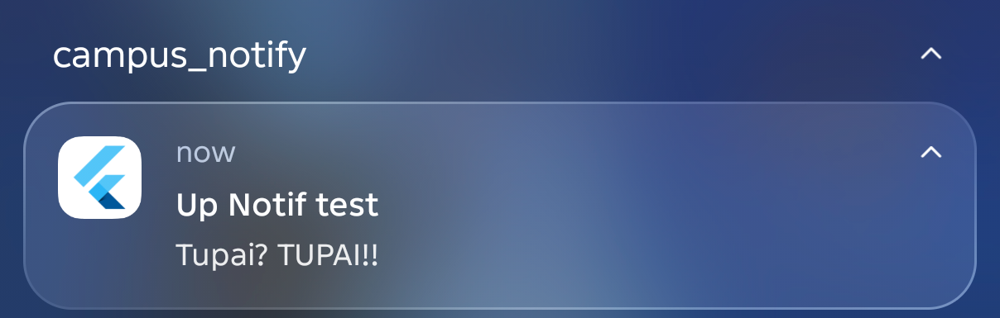
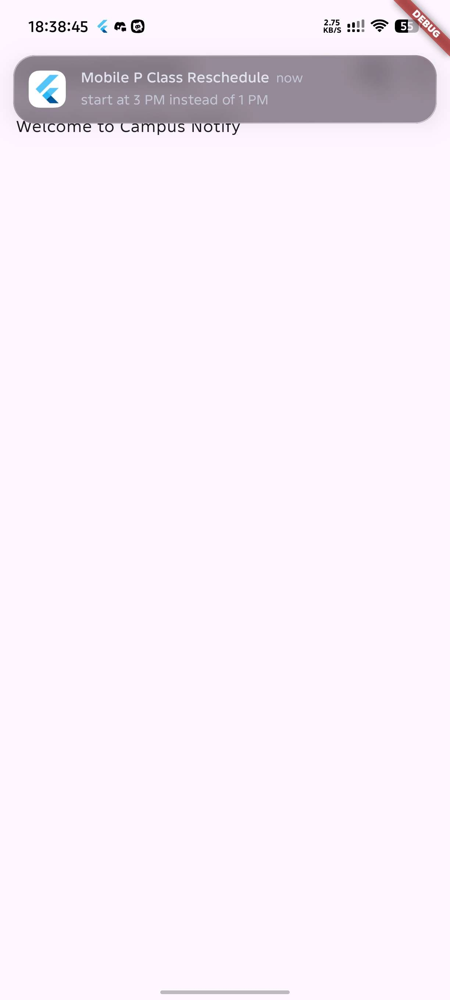
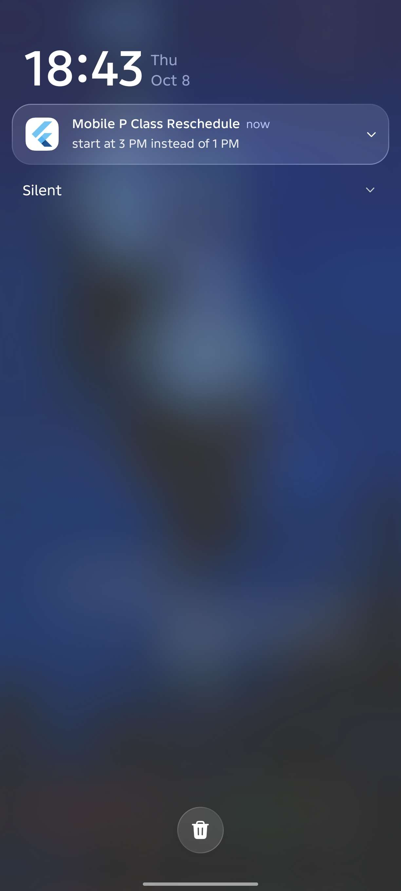
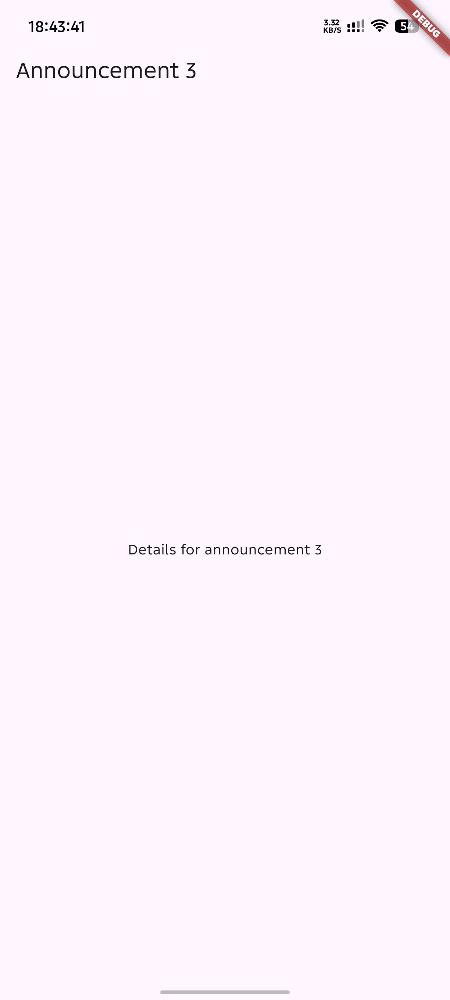
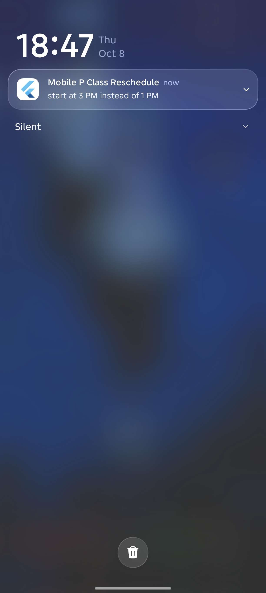
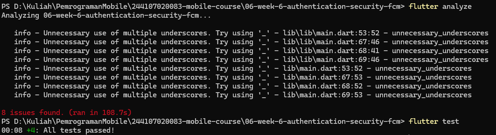
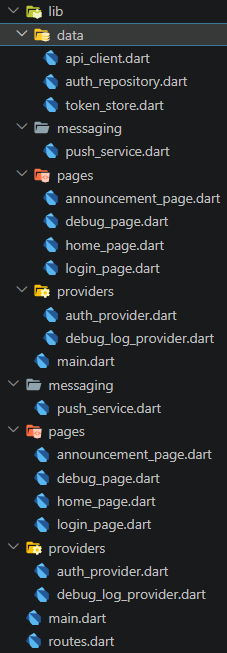

# Flutter Week 6 - Authentication, Security and FCM

This project (`campus_notify`) demonstrates a mock login with secure token storage and automatic token refresh,
Firebase Cloud Messaging (FCM) with the token lifecycle, and notification handling in the foreground,
background, and terminated app states with GoRouter deep links.

## Project Stages

### 1. Lab 1 - Login, secure storage, and token refresh

Built the authentication layer around a mock repository that can later be swapped for Firebase Auth.
- Stored the access and refresh tokens only through `TokenStore`, which wraps `flutter_secure_storage`.
- Created `AuthRepository` with a simulated login and refresh.
- Added a Dio interceptor that attaches the bearer token, refreshes once after a 401, replays the request, and clears the session when the refresh also fails.
- Added `AuthNotifier` (Riverpod `AsyncNotifier`) and a GoRouter redirect guard so unauthenticated users always land on `/login`.

### 2. Lab 2 - FCM, permission, and token lifecycle

Registered the app with Firebase and managed the FCM registration token.
- Added `google-services.json` and the `google-services` Gradle plugin, and initialized Firebase before `runApp`.
- Requested the notification permission at runtime (Android 13+ needs `POST_NOTIFICATIONS`).
- Fetched the token with `getToken()`, sent it to `POST /devices`, and listened to `onTokenRefresh` so the backend never keeps a stale token.
- Built a Debug page that shows only the first 12 characters of the token followed by `...`.
- The campus API URL is a placeholder, so the `/devices` call is logged as failed. The token flow itself is what is demonstrated.

### 3. Lab 3 - Payloads, three app states, clicks, and topics

Handled notifications in every app state using the combined `notification + data` payload (`data.route` carries the deep link).
- Registered a top-level background handler with `@pragma('vm:entry-point')`.
- Foreground: `onMessage` shows a manual local notification because the system does not show a banner.
- Background: the system shows the banner, and `onMessageOpenedApp` routes on tap.
- Terminated: `getInitialMessage()` routes after the router is ready.
- Subscribed to the `campus-announcement` topic.

Test matrix (same payload: `route = /announcement/3`, `id = 3`):

| State | Expected | Result |
|---|---|---|
| Foreground | Local banner appears, tap routes to `/announcement/3` | banner appears but can't route so it stay on the home page |
| Background | System banner appears, tap routes correctly | pass |
| Terminated | App opens to the right route via `getInitialMessage` | fail because my phone is infinix even WhatsApp can't push any notif if closed (swiped up) |

## AI Verification Checklist

* **Is the background handler a top-level function with `@pragma('vm:entry-point')`?**
Yes. `firebaseMessagingBackgroundHandler` is declared at the top level of `push_service.dart` with the annotation and is registered through `registerBackgroundHandler()`. It does not use `BuildContext` or Riverpod.

* **Does `onTokenRefresh` actually send the new token to the backend, not just print it?**
In code, yes. The same `onToken` callback is used for both the first `getToken()` and `onTokenRefresh`, and it posts to `/devices`. Because the backend URL is a mock, the request fails and the result is written to the Debug log. *(Add your wipe-data / reinstall result here.)*

* **Does foreground use a manual local notification?**
Yes. `listenForeground` calls `flutter_local_notifications` from `onMessage`, with the route as the payload.

* **Do clicks from all three states land on the correct route?**
See the test matrix above.

* **Are tokens and secrets free from hardcoding and full logging?**
Tokens are stored only in `flutter_secure_storage`. The UI and logs use `truncateToken`. The Debug page has a "Copy full token" button that only writes to the clipboard so a test message can be sent from the Firebase Console. The full token is never logged or shown on screen.

* **Do `flutter analyze` and `flutter test` pass?**

### Modifications to AI-Generated Code

After reviewing the AI output, the following fixes were needed to make the project build and behave correctly:

- **`flutter_local_notifications` API change:** the installed version requires named arguments, so `initialize(settings: ...)` and `show(id:, title:, body:, notificationDetails:, payload:)` were used instead of the positional form.
- **Core library desugaring:** enabled `isCoreLibraryDesugaringEnabled` and added the `desugar_jdk_libs` dependency in `android/app/build.gradle.kts`.
- **Duplicate Gradle plugin:** `com.google.gms.google-services` was declared twice in the app module, which broke the build. It is now declared once there and once (with `apply false`) in `settings.gradle.kts`.
- **Android 13+ permission:** added `POST_NOTIFICATIONS` to `AndroidManifest.xml`.
- **Router refresh:** added a `refreshListenable` so the login guard re-runs after login and logout.

## Refactoring and Testing

* **Moved route strings into `lib/routes.dart`** (`AppRoutes`) so GoRouter and FCM deep links share the same constants.
* **Extracted `routeFromMessage`** as a pure function so route parsing can be tested without Firebase.
* **Moved Dio error mapping into `lib/data/api_errors.dart`** (`friendlyError`) so the UI only receives user-friendly messages.
* **Tests** in `test/auth_push_test.dart` cover route parsing (empty, slash-less, and full routes), the data payload id, login status from the token, and forcing re-login after a failed refresh.

## Reflection

* **Why must refresh tokens never live in SharedPreferences? What is the risk if one leaks?**
  SharedPreferences is stored as plain, unencrypted data, so anyone who can read the app data (a rooted device, a backup, malware) can read the token. A leaked refresh token lets an attacker keep requesting new access tokens for as long as it stays valid, so it is effectively a long-lived login. `flutter_secure_storage` keeps it in the Android Keystore / iOS Keychain instead.

* **What breaks if `onTokenRefresh` is ignored for a whole semester?**
  The token can change after a reinstall, a data wipe, or a security rotation. The backend would keep sending messages to the old token, so users would silently stop receiving notifications while nothing in the app looks broken.

* **When do you use a topic vs a device token? Give one campus message example for each.**
  A topic is for broadcasts to a group, for example "Schedule changed" for all students on `campus-announcement`. A device token is for personal messages, for example a grade or a bill reminder, so only that one user receives it.

* **Which part of the AI draft did you reject or fix, and why?**
  I fixed the `flutter_local_notifications` calls to match the installed API, enabled core library desugaring, removed a duplicated Gradle plugin, added the Android 13+ notification permission, and added a router refresh so the login guard reacts to auth changes. I also moved route strings and error mapping into their own files so they can be shared and tested.
